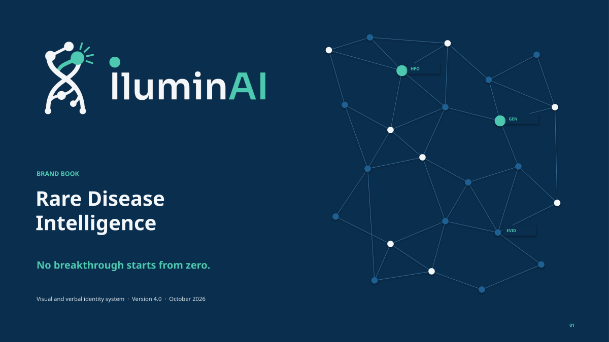
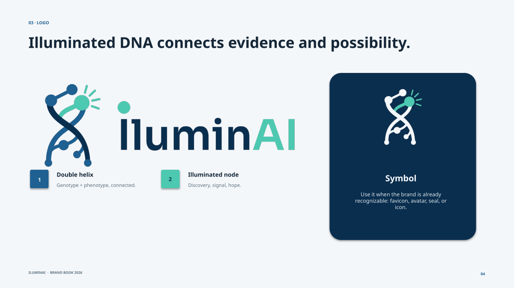
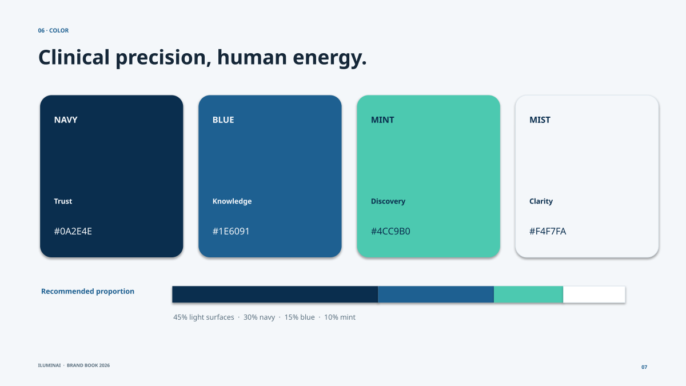
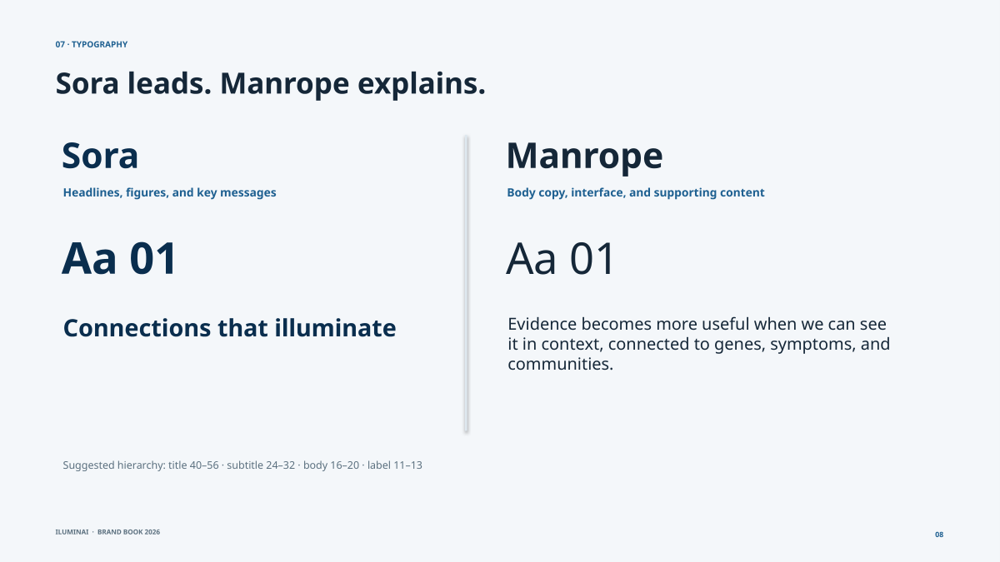
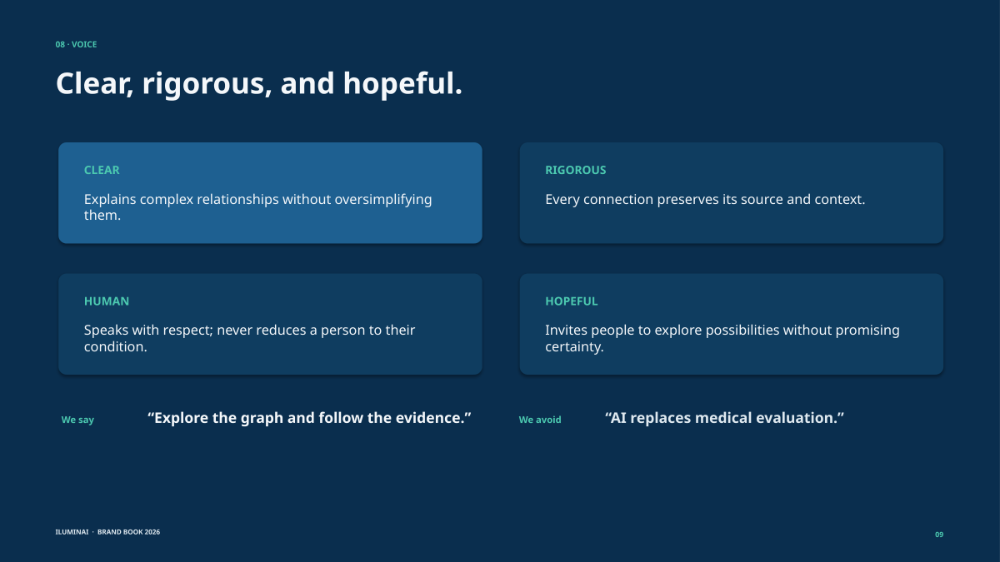
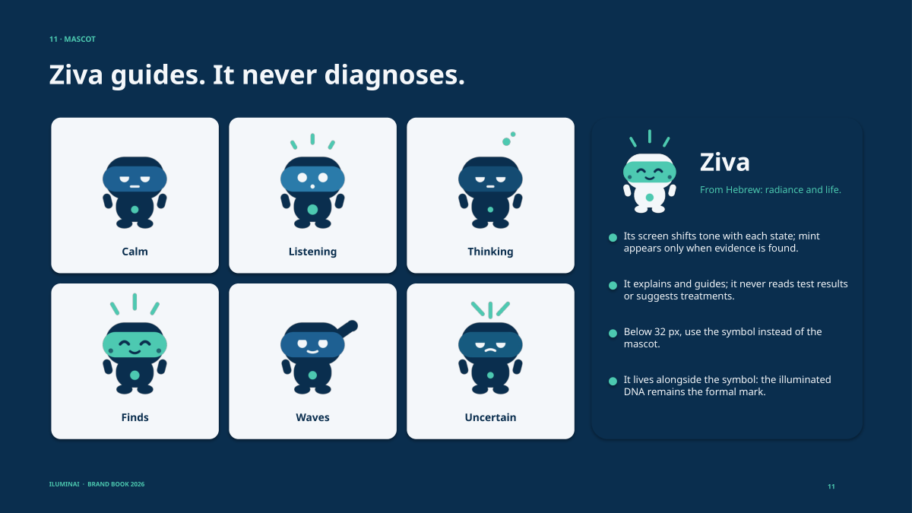
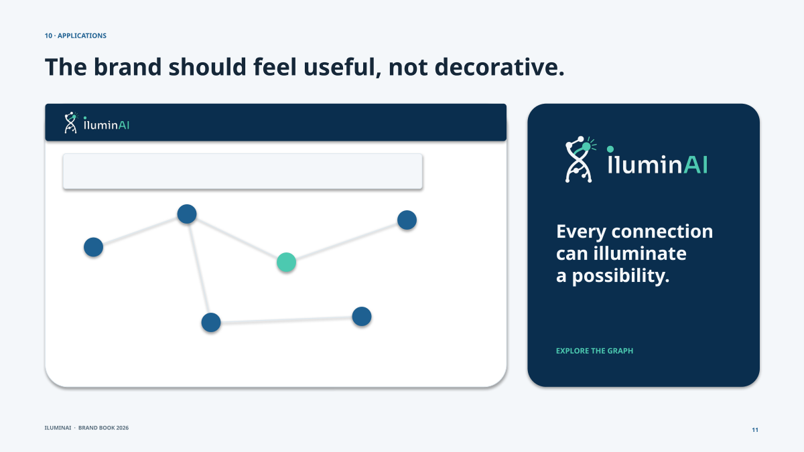

# IluminAI: Rare Disease Intelligence



> *No breakthrough starts from zero.*
> Hack-Nation 7th Global AI Hackathon · Challenge 05: **AI Atlas for the World's Rare Diseases**

IluminAI is a 3D knowledge graph of rare-disease evidence that an AI **walks through out loud**. It lights up each gene, mechanism, community, and study while it explains the connection, and every claim keeps its source.

Our first slice is **CACNA1A**, one gene with several diseases:

| Variant effect | Disease |
|---|---|
| Loss of function | Episodic ataxia type 2 (EA2) |
| Gain of function | Familial hemiplegic migraine type 1 (FHM1) |
| CAG / polyglutamine expansion | Spinocerebellar ataxia type 6 (SCA6) |
| De novo | Developmental and epileptic encephalopathy 42 (DEE42) |

It demonstrates the two ideas the challenge asks for:
1. **Same gene ≠ same disease.** A therapy that silences CACNA1A could help FHM1 (gain of function) and harm EA2 (loss of function). The graph models **variant → mechanism**, not just gene names.
2. **Different genes, same mechanism.** ATP1A2 and SCN1A also cause hemiplegic migraine. KCNA1, CACNB4 and SLC1A3 also cause episodic ataxia. These are communities that could share research without knowing it.

---

## Quick start

```bash
cd atlas
cp .env.example .env.local      # add your OpenAI API key
npm install
npm run dev                     # http://localhost:5173  (Chrome or Edge, for voice)
```
- **▶ Demo**: scripted journey of a family with EA2. No LLM needed.
- **Explore**: ask a question in natural language. The AI answers step by step and illuminates the graph.
- **Click any link**: evidence panel with source, quote, status, confidence and contradictions.

## Reproduce the dataset

```bash
python scripts/fix_ids.py        # resolve every ID against official APIs (writes data/id_map.json, data/gaps.md)
python scripts/verify_ids.py     # independent audit: 0 MISMATCH / 0 NOT FOUND expected
python scripts/build_graph.py    # validate the data contract → graph.json, gaps.json, review_queue.json
                                 # (includes contributions pending review; --no-contrib for verified-only)
```
Current graph: **107 nodes, 193 links** (90 observed / 100 extracted / 3 inferred). Audit log: `data/gaps.md`.

---

## Architecture

```
┌──────────── DATA PIPELINE (offline, Python) ────────────┐
│ AI-assisted research → data/nodes.jsonl, edges.jsonl    │
│ fix_ids.py    → every ID resolved via official APIs     │
│ verify_ids.py → audit against HGNC, HPO, NCBI, CT.gov   │
│ build_graph.py→ contract validation → graph.json        │
└─────────────────────────────────────────────────────────┘
                         │ static file
┌──────────── BROWSER (React + Three.js) ─────────────────┐
│ 🎤 Web Speech API → question text                        │
│ subgraph.ts  → Graph-RAG retrieval (≤2.5k tokens)        │
│ POST /api/ask ───────────────┐                           │
│ drop invented ids ◄──────────┤ JSON script of steps      │
│ for each step:               │                           │
│   Graph3D lights + camera    │                           │
│   voice reads the step       │                           │
└──────────────────────────────┼───────────────────────────┘
┌──────────── SERVERLESS (Vercel Functions) ──────────────┐
│ api/ask.ts → OpenAI gpt-5.4-mini (Structured Outputs)    │
└─────────────────────────────────────────────────────────┘
```

Key decisions:
- **The graph is a static file, not a database.** It is read-only and small, so it lives in browser memory. No infrastructure to run.
- **The LLM never sees the whole graph.** It only gets a scored, budgeted subgraph. This saves tokens and limits hallucination.
- **The LLM does not drive the UI directly.** It returns a *script*, and the browser validates it and plays it. One LLM call per question, and light and voice stay in sync by design.

---

## Data model

### Nodes
```json
{"id":"HGNC:1388","type":"gene","label":"CACNA1A","synonyms":["Cav2.1"],
 "summary_plain":"Gene for a calcium channel that lets nerve cells send signals.","cluster":"cav21"}
```
12 types: `disease · gene · variant · mechanism · phenotype · patient_group · paper · study · asset · researcher · funder · treatment`.

Stable identifiers, so anyone can verify them:

| Prefix | Source | Example |
|---|---|---|
| `OMIM:` | OMIM | `OMIM:108500` (EA2) |
| `HGNC:` | HUGO Gene Nomenclature | `HGNC:1388` (CACNA1A) |
| `HP:` | Human Phenotype Ontology | `HP:0001251` (Ataxia) |
| `ClinVar:` | ClinVar | `ClinVar:8504` (p.Ser218Leu) |
| `PMID:` | PubMed | `PMID:15136697` |
| `NCT…` | ClinicalTrials.gov | `NCT01543750` |
| `org: person: asset: tx: mech: funder:` | curated slugs | `org:ataxia-uk` |

`synonyms` power the single search box ("EA2", "Cav2.1" and "episodic ataxia" all resolve to the same node). `summary_plain` is written for families, not specialists.

### Links: every edge carries its evidence
```json
{"id":"L12","source":"HGNC:1388","target":"OMIM:108500","type":"causes",
 "status":"observed","confidence":0.95,
 "evidence":[{"source":"OMIM","url":"https://omim.org/entry/108500","quote":"…"}],
 "contradicts":[]}
```

| `status` | Meaning |
|---|---|
| `observed` | From a **curated database** (OMIM, HPO, ClinVar, ClinicalTrials.gov, NIH RePORTER, HGNC) |
| `extracted` | From a **paper**, with a literal quote from the abstract |
| `inferred` | A **hypothesis** generated by the system (confidence ≤ 0.6) |
| `contributed` | Community contribution, pending expert review |

Edge types: `causes · has_variant · variant_effect · disrupts · has_phenotype · shares_mechanism · investigates · funds · registry_for · trial_for · treats · model_of · member_of · same_family · model_transfer_candidate`.
- `same_family`: links genes sharing an official, non-generic HGNC protein family / gene group.
- `model_transfer_candidate`: hypothesized transfer of disease animal/cellular models from one gene to an unmodeled paralog of the same family.

Optional expert review field on links:
```json
"review": {"by": "Dr. Name", "date": "YYYY-MM-DD", "verdict": "confirmed|disputed"}
```

*Vision:* Ingestion agents (e.g. Bright Data) and community contributions enter as `contributed`; they never become `observed` without automated ID validation and expert review.

- `contradicts` points to links this evidence conflicts with. They are rendered in amber.
- Hard rule: **no link without `evidence[0].url`**. `build_graph.py` rejects it.

---

## Anti-hallucination layers

| # | Where | Prevents |
|---|---|---|
| 1 | `fix_ids.py` | Invented PMIDs, NCTs or variants. Every ID comes from a real HTTP response |
| 2 | `verify_ids.py` | An ID that exists but points to something else |
| 3 | `build_graph.py` | Links without a source, dangling endpoints, invalid status |
| 4 | System prompt | The LLM using knowledge outside the provided subgraph |
| 5 | `App.tsx` | The LLM illuminating node or link ids it was not given |
| 6 | UI + voice | Users confusing a hypothesis with a fact (status is always shown and spoken) |

Why layer 1 exists: the first LLM-generated draft had correct biology but **fabricated identifiers** (0/14 PMIDs, 0/8 ClinVar variants and 0/6 trials pointed to the right record). Any ID that cannot be resolved by an API is now dropped and logged in `data/gaps.md`.

---

## 3D rendering (`atlas/src/Graph3D.tsx`)

- **`react-force-graph-3d`** (Three.js / WebGL + d3-force-3d). There are no hand-placed coordinates: nodes repel, links act as springs, and **clusters emerge from the connections**. The hemiplegic migraine, episodic ataxia and polyQ-SCA groups form on their own.
- **One reactive input:** `highlight = { nodes, links, focus }`. The component knows nothing about AI or voice. Highlighted nodes turn mint and get a brand-book tag, everything else dims, mint particles flow along highlighted links, and the camera flies to `focus`.
- **Visual encoding (IluminAI Brand Book v3):** navy background. Diseases are white, biology is blue, community and evidence are light blue. **Mint is reserved for what the AI illuminates** (the brand's "signal of discovery"). Link opacity encodes observed > extracted > inferred. Amber marks a contradiction.

## Question flow (Graph-RAG)

1. **Voice → text** with the Web Speech API.
2. **Retrieval** (`subgraph.ts`):
   - Seed nodes come from label and synonym matches.
   - Intent detection (e.g. "group" → `patient_group`).
   - A 2-hop BFS scores each link by `(3 − hop)·10 + status_rank·2 + confidence + intent bonus`.
   - Links are added until a **~2.5k-token budget** is full, then serialized compactly (`L12|HGNC:1388>causes>OMIM:108500|observed|0.95`).
3. **Generation** (`api/ask.ts`):
   - Input is validated at the boundary.
   - One OpenAI `chat/completions` call with a strict `json_schema` (Structured Outputs).
   - The prompt requires using only the subgraph, stating each link's status, warning about loss- vs gain-of-function, saying "no route" when there is none, and ending with **one concrete next step**.
4. **Playback:** invented ids are dropped. Each step lights the graph, moves the camera and is spoken aloud.

## Expert-validated product requirements (frontend)

Before building, we interviewed a rare-disease research scientist who advises patient foundations and funders on where to allocate resources. She confirmed four gaps, and they define what the interface must show. Status reflects this repository today.

| # | Gap confirmed by the expert | What the frontend must show | Status |
|---|---|---|---|
| 1 | **Information is scattered**, so families and groups duplicate effort and spend money twice. Patients with similar symptoms (e.g. epilepsy) could share therapies that worked, whatever their exact mutation. | One search across disease, gene, symptom and patient group. A **"shared symptoms → therapies" view**: other diseases with the same HPO symptoms and the treatments linked to them, each with its source and an explicit *"hypothesis, discuss with your doctor"* label. | 🟡 Search, roles and evidence panel ✅ · shared-symptom view 🚧 |
| 2 | **Variant effect decides the therapy.** Loss vs. gain of function changes which modality can help, and patients could be clustered by effect instead of testing every mutation. | A **mechanism badge** (LoF / GoF / polyQ) on every disease and variant. A mandatory warning when a question mixes opposite mechanisms. In "What's missing", the count of **variants of uncertain significance (VUS)** whose effect is still unknown. | 🟡 LoF/GoF warning in AI answers ✅ (all 3 roles in live eval) · per-node badges and VUS count 🚧 |
| 3 | **Protein-family analogies.** If a related protein (same family) already has mouse or cell models, that knowledge can speed up research on one that has none. | A **family panel**: genes in the same HGNC family, their existing models, and which models could transfer, labeled as hypotheses pending expert review. | 🟡 `same_family` links from HGNC and `model_transfer_candidate` hypotheses ✅ · dedicated panel 🚧 |
| 4 | **Say what is missing**, not only what exists (e.g. "cell line available, animal model missing"), so investment and effort go to real gaps. | **"What's missing"** on every disease: animal model, cell model, registry/group, natural history, trial, treatment, researcher, with an honest note that absence means "not found in the sources searched". | ✅ |

Cross-cutting requirements from the same session and from our architecture:
- **Roles:** the same evidence explained for a *family*, an *organization* or a *researcher* (tone, depth and next step). ✅
- **Human in the loop:** agent and community contributions are shown as **pending expert review** (amber) and never as facts. Researchers and patient organizations confirm or dispute them, and the result appears as an "Expert-reviewed" badge. Display ✅ · review queue panel ✅ · confirm/dispute actions 🚧 (sign-in required)
- **Every connection explains itself:** source, status (observed / from paper / hypothesis / pending review), confidence and contradictions, one click away. ✅
- **Scales beyond one gene:** the research agent (`scripts/expand_disease.py`) builds a new disease and the UI replays how it was built, step by step. ✅

## Built with OpenAI

IluminAI uses **one model in production: OpenAI `gpt-5.4-mini`**, called through the official OpenAI API (`https://api.openai.com/v1/chat/completions`) from a single serverless function, `atlas/api/ask.ts`.

| Challenge role | What OpenAI does in IluminAI | Where |
|---|---|---|
| **Explain** | Turns a scored subgraph into a step-by-step evidence script in plain language. Every step names the node and link ids it relies on, so the UI can light them up and show their sources | `atlas/api/ask.ts` |
| **Explain (safety)** | Produces a mandatory `mechanism_warning` when diseases in the answer have opposite mechanisms (loss vs. gain of function), e.g. a therapy for FHM1 may not help, or may harm, EA2 | `atlas/api/ask.ts` (`SCRIPT_SCHEMA`) |
| **Adapt** | Rewrites the same evidence for three audiences: `family`, `organization` and `researcher` | role prompts in `atlas/api/ask.ts` |
| **Extract** | Re-extracts the supporting sentence for every PubMed-backed link from its abstract; a quote is kept only if it appears verbatim (35 of 78 verified) | `scripts/openai_extract.py` |
| **Extract + Reconcile (agent)** | scripts/expand_disease.py builds a new disease subgraph from official APIs; OpenAI extracts claims with verbatim-verified quotes; results enter as "contributed" pending expert review | `scripts/expand_disease.py` |

How we use it:
- **Extraction is verified deterministically:** a model quote that is not a literal substring of the abstract is rejected.
- **Structured Outputs:** `response_format: json_schema` with `strict: true`, so every answer has exactly the script shape the UI plays.
- **Grounding:** the model only sees the retrieved subgraph, and the browser drops any id it was not given (see *Anti-hallucination layers*).
- **Live evaluation:** `atlas/eval/ask_eval.ts` runs 3 questions × 3 roles against the real API and checks id validity, the LoF/GoF warning and latency. `gpt-5.4-mini` scored 100% valid ids and the mechanism warning in all three roles, at 2–4 s per answer and about 5k tokens per question.
- **Configuration:** `LLM_BASE_URL`, `LLM_MODEL`, `LLM_KEY` and `LLM_EXTRA` in `.env.local` (locally) or in Vercel environment variables. Keys are never committed.

## Bright Data MCP Integration

Patient-group discovery uses the Bright Data MCP (`search_engine`, `scrape_as_markdown`) when `BRIGHT_DATA_API_TOKEN` is set; quotes are kept only if they appear verbatim in the scraped page. The DEE69 demo run used it: 3 searches, 7 pages scraped, 1 patient group and 1 company kept with verbatim quotes.

*Bright Data connector and initial CACNA1A scrape by Brandon Vilchis.*

**Data sharing disclosure:** demo traffic for this hackathon is sent to OpenAI under its data-sharing program (the graph itself is public biomedical data). A production deployment would use zero data retention, because families may type health information.

**Development tools (transparency):** the codebase and the initial literature search were written with AI coding assistants (Anthropic Claude and Google Gemini). They are not part of the running product. Every identifier in the dataset was then resolved and audited against official APIs (`scripts/fix_ids.py`, `scripts/verify_ids.py`), and the audit log is in `data/gaps.md`.

## Deploy
Step-by-step guide: [`DEPLOY.md`](DEPLOY.md).

Import the repo in Vercel with **Root Directory = `atlas`** and set the 4 environment variables. `api/ask.ts` deploys as a serverless function. In local development, `vite.config.ts` serves the same file.

## Repository map
```
atlas/                 web app (Vite + React + TypeScript)
  api/ask.ts           question → script of steps (serverless)
  src/Graph3D.tsx      reactive 3D graph + brand identity
  src/subgraph.ts      Graph-RAG retrieval with token budget
  src/App.tsx          layout, question flow, script player
  public/data/graph.json
  public/brand/        logo assets from the brand book
data/                  nodes/edges.jsonl, id_map.json, gaps.md
scripts/               fix_ids, verify_ids, build_graph
```

## Brand identity

The IluminAI visual and verbal identity was designed by **Luis Chávez**. Full brand book: [`docs/brand/IluminAI-Brand-Book.pdf`](docs/brand/IluminAI-Brand-Book.pdf).

**Essence:** a knowledge network that makes the invisible visible. **Signal:** evidence → connection → direction.

| | |
|---|---|
|  |  |
| **Logo.** An illuminated DNA strand: genotype and phenotype, connected; the mint node is discovery, signal and hope. | **Color.** Navy `#0A2E4E` (trust), Blue `#1E6091` (knowledge), Mint `#4CC9B0` (discovery), Mist `#F4F7FA` (clarity). Mint is reserved for signals of discovery. |
|  |  |
| **Typography.** Sora leads (headlines, figures); Manrope explains (body and interface). | **Voice.** Clear, rigorous, human and hopeful. We say *"Explore the graph and follow the evidence."* We never say *"AI replaces medical evaluation."* |



**Ziva** (from Hebrew: radiance and life) is the guide inside the app. Its screen shifts with each state (calm, listening, thinking, finds, waves, uncertain), and mint appears only when evidence is found. Ziva explains and guides; **it never diagnoses, reads test results or suggests treatments**.

**How the brand drives the product:**
- The 3D graph uses the brand palette as data encoding. Mint means "illuminated by the AI", and nothing else is mint.
- Ziva's state follows the app state (thinking while the model answers, finds when a supported path exists, uncertain on partial or no route).
- Every answer carries the same promise as the brand: traceable evidence, equitable access, professional validation.



## Team IluminAI
| Member | Role |
|---|---|
| Marino Chávez | Molecular biologist · backend, knowledge graph, evidence curation and AI pipeline |
| Brandon Vilchis | Agentic search · scraper and Bright Data integration |
| Luis Chávez | Brand identity (brand book, Ziva) · user interface and deployment |
| Itzel Michua | User interface and deployment |

## Known limits
- **Clustering** is currently implicit (force layout plus curated `cluster`). Next step: phenotype similarity weighted by HPO information content, plus community detection.
- **Scale:** a static file works up to a few thousand nodes. Beyond that, a graph database with server-side retrieval.
- **Coverage:** one gene and its mechanistic neighbors. The pipeline (research → fix_ids → verify → build) is repeatable for any gene.
- **Unreviewed links are hidden, not deleted.** 43 links (mostly treatments and researcher affiliations) could not be backed by a verbatim quote from their source abstract, so `build_graph.py` hides them (and 12 nodes that only had those links) until an expert reviews them. They stay in `data/edges.jsonl` with `needs_review`; `python scripts/build_graph.py data --include-unreviewed` shows them. The research agent can re-search real supporting papers for each one.
- **Not medical advice.** IluminAI helps families and researchers frame better questions. Every path ends in professional validation.
